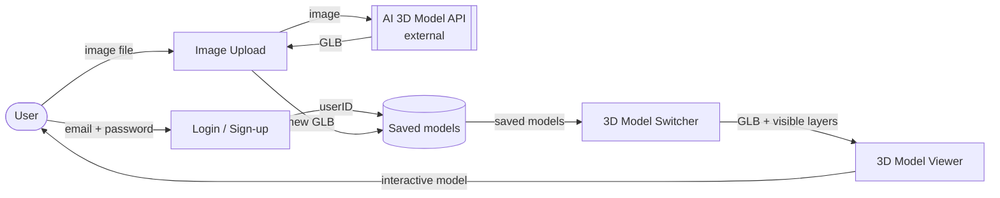

# Web-Based Interactive Model Visualizer

**Team AVJS** · CS 5001 / 5002 Senior Design · University of Cincinnati

> **Goal:** Create a web-based model visualizer that lets users quickly change the layers of a 3D model, and create models from uploaded images using AI.

This project builds an AI-assisted WebGL tool for viewing and exploring volumetric data in the browser. A user can upload an image, have it turned into a 3D model, save it to their account, and then rotate, zoom, and switch between layers of the model. Example uses include brain cross-sections for medical students, rock and sediment layers for geologists, powertrain parts for engineers, and building floors for emergency responders.

---

## Team

| Member | GitHub | Owns (D0) |
|---|---|---|
| Abby Kraft | [@abkatchill](https://github.com/abkatchill) | Image Upload |
| Veronica Malusky | [@maluskvp](https://github.com/maluskvp) | Login / Sign-up |
| Jake Martin | [@jakeMartin614](https://github.com/jakeMartin614) | 3D Model Switcher |
| Sophia Munoz | [@munozsophia](https://github.com/munozsophia) | 3D Model Viewer |

**Advisor:** Professor Ming Tang

Full contact details and bios are in [Project_Description.md](Project_Description.md).

---

## How it works



| Component | Responsibility |
|---|---|
| **Login / Sign-up** | Authenticates the user so models are saved to their own account. |
| **Image Upload** | Validates an uploaded image and sends it to the AI service to get a 3D model (GLB). |
| **3D Model Switcher** | Lets the user pick a saved model and choose which layers are visible. |
| **3D Model Viewer** | Renders the selected model in the browser for interactive inspection. |

Architecture: **client-server** for login, storage, and the switcher; a **pipeline** for image → AI → validated GLB; and a **layered**, client-side design for the viewer. The reasoning is in the design documents below.

---

## Repository contents

```
.
├── README.md                  ← you are here
├── Project_Description.md     Team members and project topic
├── Constraints_Essay.md       Economic, social, and professional constraints
├── User_Stories.md            Stakeholder map, user stories US-01 to US-05, use case UC-01
├── bios/                      Team member professional bios
└── Design_Diagrams/
    └── D0_High_Level_Design.pdf    Components, interfaces, data flow, patterns
```

### Design documents

| Document | Week | Status |
|---|---|---|
| [D0 – High-Level Design](Design_Diagrams/D0_High_Level_Design.pdf) | 5 | ✅ Submitted |
| D1 – Detailed Design, Part 1 (data model, algorithms, API, tech choices) | 6 | 🛠 In progress |
| D2 – Detailed Design, Part 2 | 7 | ⏳ Upcoming |

D1 and D2 will be added to `Design_Diagrams/` next to D0, along with their diagram source files.

---

## Planned tech stack

These choices are still being finalized in D1.

| Layer | Choice |
|---|---|
| Front end | React with Ant Design (upload UI) |
| 3D rendering | WebGL in the browser |
| Model format | GLB (binary glTF) |
| Database | PostgreSQL |
| 3D generation | Hosted AI image-to-3D API |

---

## Course milestones

- [x] Project selection and constraints essay
- [x] User stories and use cases
- [x] D0 – High-level architecture
- [ ] D1 – Detailed design, part 1
- [ ] D2 – Detailed design, part 2
- [ ] Project plan and task assignments
- [ ] Technical specification
- [ ] Test plan
- [ ] Oral presentations